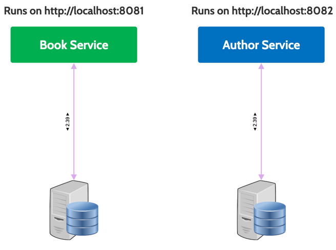
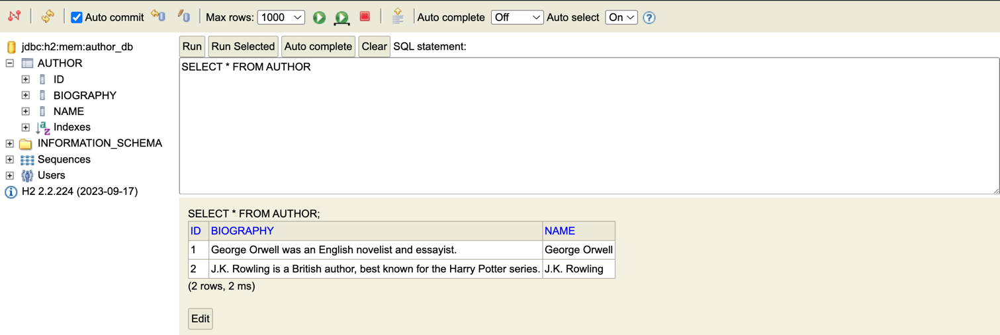
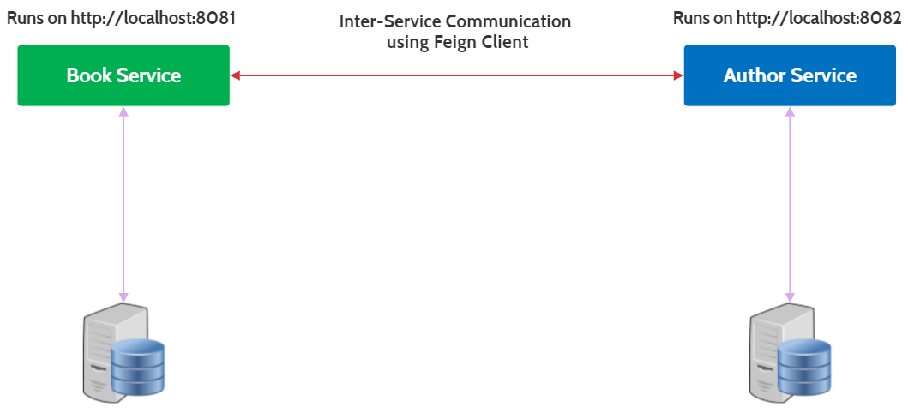

#  Monoliths to Microservices

| Title                      | Type   | Duration | Author               |
|----------------------------|--------|----------|----------------------|
| Monoliths to Microservices | Lesson | 5:00     | Suresh Melvin Sigera |

## Lesson Objectives

- Understand Microservices Architecture
- Learn the key components of a Microservices Architecture
- Explore the benefits of using Microservices
- Meet common design patterns used in Microservice Architectures
- Implement a Microservices Architecture using Spring Boot
- Create and configure Microservices for Author and Book Management
- Use Feign Clients for inter-service communication
- Implement Data Seeders to populate Microservices with initial data
- Define API endpoints for Microservices
- Demonstrate communication between Microservices

## Introduction to Microservices (5 minutes)

The concept of microservices emerged as a response to the limitations of monolithic architectures. 

In the early days of web applications, most systems were built as monoliths – single, self-contained units that encompassed all functionalities. However, as applications grew in complexity and scale, developers faced challenges with monoliths in terms of maintainability, scalability, and the ability to adopt new technologies.. as we've seen.

The roots of microservices can be traced back to service-oriented architecture (SOA) principles from the early 2000s. However, microservices took these concepts further, emphasizing smaller, more focused services and leveraging modern development practices like continuous delivery and DevOps.

The term "microservices" was first coined around 2011-2012, with early adopters like Netflix and Amazon paving the way. The approach gained widespread attention following Martin Fowler and James Lewis's article [Microservices](https://martinfowler.com/articles/microservices.html) in 2014, which articulated the key ideas and benefits of this architectural style.


### Key Principles of Microservices

- **Single Responsibility**: Each service should focus on one specific business capability.
- **Autonomy**: Services should be independently deployable and scalable.
- **Decentralization**: Embracing decentralized governance and data management.
- **Resilience**: Designing for failure to ensure system-wide resilience.
- **Evolutionary Design**: Enabling the continuous evolution of the system.

## Well known examples (15 minutes)

###  Netflix

Netflix's journey to microservices began in 2008 when they started moving away from their monolithic DVD rental application to a cloud-based streaming service.

#### Architectural Overview:

- Over 800 microservices handling different aspects of the streaming service.
- Utilizes Amazon Web Services (AWS) for cloud infrastructure.
- Implements a stateless architecture where services don't maintain session state.

#### Key Innovations:

- Created _Eureka_, a service registry for service discovery with built in load balancing.
- Implemented _Hystrix_, a latency and fault tolerance library designed to isolate points of access to remote systems, services and 3rd party libraries.
- Many others, many of which are a part of the **Spring Cloud Ecosystem** many of which we'll be studying and using! 

#### Outcomes

- Ability to handle over 1 billion streaming hours per month.
- Reduced outages and improved system reliability.
- Enabled rapid innovation and deployment of new features.

### Amazon
Amazon's transition to microservices was driven by the need to scale rapidly and innovate quickly in the competitive e-commerce space.

#### Architectural Overview:

Started with a monolithic application in the early 2000s.
Gradually decomposed the monolith into services, with a major push around 2001.
By 2010, Amazon had thousands of services powering various aspects of its retail and cloud operations.

#### Key Innovations:

- Developed a service-oriented architecture that later evolved into what we now call microservices.
- Created Amazon Web Services (AWS) partly as a result of standardizing their internal infrastructure.

#### Outcomes:

- Ability to release code every 11.7 seconds on average.
- Improved scalability, allowing Amazon to handle massive traffic spikes during peak shopping seasons.
- Accelerated innovation across various product lines and services.

### Uber

Uber's microservices architecture enables them to manage a complex, real-time platform across multiple geographies and services.

#### Architectural Overview:

Started with a monolith but quickly moved to microservices as the business expanded rapidly.
Uses a domain-oriented microservice architecture (DOMA).
Employs over 2,200 microservices.

#### Key Innovations:

- Developed _Ringpop_, a library for creating scalable and fault-tolerant applications.
- Created _TChannel_, an RPC protocol for microservice architectures.
- Implemented _Jaeger_, an open-source, end-to-end distributed tracing system.

#### Outcomes:

- Ability to process millions of trips per day across 600+ cities.
- Rapid expansion into new markets and services (e.g., Uber Eats).
- Improved system reliability and faster feature deployment.

## Evaluating Microservices (5 minutes)

### Advantages of Microservices

- **Scalability**: Services can be scaled independently based on demand.
- **Flexibility**: Easier to adopt new technologies and frameworks for specific services.
- **Resilience**: Failure in one service doesn't necessarily affect others.
- **Faster deployment**: Smaller codebases enable quicker development and release cycles.
- **Team autonomy**: Different teams can work on different services independently.

### Disadvantages of Microservices

- **Complexity**: Distributed systems are inherently more complex to develop and manage.
- **Operational overhead**: Managing multiple services requires more resources and sophisticated tooling.
- **Data consistency**: Maintaining data integrity across services can be challenging.
- **Network latency**: Inter-service communication can introduce performance issues.
- **Testing challenges**: Integration and end-to-end testing become more complex.

## Microservices Design Patterns (30 minutes)

Now let's dive into some common design patterns for Microservices architectures.

Well cover more later, this is just a start!


### Strangler Fig


Credit: https://www.science.org/content/article/being-strangled-may-save-tree-s-life


The name is derived from the way a strangler fig plant grows around a tree, slowly taking over the original tree until it completely replaces it. Similarly, this pattern allows you to incrementally replace a monolithic system with a new architecture (like microservices) without requiring a full system rewrite all at once.

In the strangler fig pattern, instead of attempting a large-scale "big bang" rewrite of a legacy system, you selectively replace specific functionalities or modules of the old system with new ones. 

The legacy system continues to operate while individual parts are migrated to new implementations. Over time, the legacy codebase shrinks, and the new system grows, eventually "strangling" the old system out of existence.

Here’s how the process typically works:

1. **Identify a Functionality to Migrate**: Start by identifying a specific functionality or module in the legacy system that you want to replace (e.g., user authentication, order processing).
    
2. **Create New Functionality in the New System**: Develop the same functionality in the new system (often a microservices-based architecture). The new system might run in parallel to the legacy system.
    
3. **Redirect Traffic**: Gradually redirect traffic from the legacy system to the new system. For instance, requests for certain functionalities can be routed to the new service while other requests continue to use the legacy system.
    
4. **Decommission the Old Code**: Once the new system successfully handles the functionality, the corresponding legacy code can be decommissioned.
    
5. **Repeat**: Continue this process for other functionalities, slowly migrating each piece of the legacy system until the entire system has been replaced.

### API Gateway


Credit: https://unsplash.com/photos/a-large-stone-building-with-statues-jTsLAKdRuaE

The **API Gateway Pattern** is a design pattern commonly used in microservices architectures to provide a single entry point for client requests to multiple backend services. The API Gateway acts as an intermediary that handles all the communication between external clients (such as web, mobile, or other services) and the various microservices in the system. This approach abstracts the complexity of the underlying microservices, providing a simplified and unified API for clients to interact with.

### **How the API Gateway Pattern Works**

In a microservices architecture, each service typically has its own API. However, exposing all of these APIs directly to the clients can lead to several challenges, such as security concerns, increased complexity for the client, and the need to manage multiple API endpoints. The API Gateway solves these problems by consolidating and managing traffic from the outside world into a single point.

#### **Key Functions of an API Gateway**:

1. **Request Routing**: Routes client requests to the appropriate microservice(s) based on the endpoint or logic within the gateway.
2. **Aggregation**: Aggregates results from multiple microservices and returns a combined response to the client, reducing the number of client requests.
3. **Security Enforcement**: Provides centralized security features like authentication, authorization, rate-limiting, and logging.
4. **Protocol Translation**: Converts communication protocols (e.g., HTTP to gRPC, WebSocket) between the client and backend services.
5. **Load Balancing**: Balances incoming requests across instances of microservices to optimize resource usage and performance.
6. **Response Caching**: Caches responses from microservices to reduce load and speed up subsequent requests.
7. **Rate Limiting and Throttling**: Controls how frequently clients can call the APIs, preventing overload or abuse of the services.
8. **Circuit Breaking and Failover**: Protects the system by automatically handling service failures, retries, or falling back to alternative services.

#### Examples:

- Nginx
- Netflix Zuul
- Kong
- AWS API Gateway

### Circuit Breaker


Credit https://electronics.howstuffworks.com/circuit-breaker.htm


The **Circuit Breaker Pattern** is a microservices design pattern used to prevent cascading failures and manage fault tolerance in distributed systems. It works by monitoring the interactions between services and automatically stopping requests to a failing service, allowing the system to recover gracefully rather than allowing failures to propagate through the system.

It's similar conceptually similar to an electrical circuit breaker. When a service experiences failures (like timeouts or connection errors), the circuit breaker "trips," halting further requests to the failing service for a specified period. 

During this time, the circuit breaker can either return an error to the client or use a fallback mechanism to respond gracefully. 

Once the issue is resolved, the circuit breaker will reset, and normal traffic can resume.

The pattern typically has three states:

1. **Closed (Normal Operation)**:
    
    - The circuit is closed, allowing requests to flow normally to the service.
    - The system monitors for failures (e.g., timeouts, exceptions).
    - If a certain threshold of failures is reached, the circuit breaker moves to the "open" state.

2. **Open (Tripped)**:
    
    - When the failure threshold is reached, the circuit opens, and requests to the failing service are blocked for a fixed amount of time.
    - During this time, the system might return cached data, a fallback response, or an error message to the client.
    - This helps avoid overloading a failing service and allows it time to recover.
1. **Half-Open (Trial)**:
    
    - After the open state, the circuit breaker moves to a "half-open" state to test if the service has recovered.
    - It allows a limited number of requests through to see if the service is responsive.
    - If successful, the circuit returns to the closed state. If failures persist, it goes back to the open state.

#### **Example Scenario: E-Commerce Platform**

Imagine a microservices-based **e-commerce platform** where different services (like payment, order processing, inventory) interact with each other. Let's consider a **Payment Service** that handles payments and a **Notification Service** that sends out order confirmations.

#### Without a Circuit Breaker:

- If the Payment Service becomes unresponsive or slow (due to a database issue, network problem, etc.), clients will continue making requests, increasing load on the Payment Service.
- The Notification Service, dependent on the Payment Service, will also start to fail, leading to a cascading failure where other services are impacted.
- The whole system might slow down or crash, resulting in a poor user experience.

#### With a Circuit Breaker:

- The Circuit Breaker Pattern monitors the Payment Service. If it starts failing (e.g., too many timeouts or errors), the circuit breaker **opens**, preventing further requests to the service for a period of time.
- During the open state, the system can return a fallback response (e.g., "Payment system is currently down, please try again later") or return cached responses.
- This prevents overloading the Payment Service and gives it time to recover.
- After a cooldown period, the circuit breaker moves to a half-open state and sends a few test requests. If successful, normal traffic resumes.

### Bulkhead Pattern


Credit https://unsplash.com/photos/the-nose-and-anchors-of-a-black-icebreaker-moored-in-the-port-v3_TkzmFsXM


The **Bulkhead Pattern** is a microservices design pattern that focuses on isolating different parts of a system to prevent a failure in one component from affecting others. This pattern is inspired by the bulkheads used in ships, which compartmentalize sections of the ship to contain damage and prevent the entire ship from sinking if one section is breached.

In a microservices architecture, the **Bulkhead Pattern** isolates resources (such as thread pools, memory, or database connections) across different services or components. This ensures that a failure or resource exhaustion in one service doesn't cause a cascading failure across the entire system. By creating isolated "bulkheads," services can fail gracefully and independently, preserving the overall system's stability.

### **How the Bulkhead Pattern Works**

In a typical system, multiple services or components share resources (like database connections, memory, or threads). If one service becomes overloaded or fails, it can deplete these shared resources, causing the entire system to fail. The Bulkhead Pattern prevents this by isolating resource pools so that each service has its own dedicated set of resources.

#### **Key Concepts of the Bulkhead Pattern**:

1. **Resource Isolation**:
Resources like CPU threads, memory, and database connections are allocated separately for different services or operations, ensuring that no single service can monopolize the resources.
2. **Limits on Resource Usage**: Each service or operation has its own limit on resource usage. For example, each service might have its own thread pool or connection pool, limiting how many concurrent requests it can handle.
3. **Service Independence**: If one service exhausts its allocated resources or fails, it won't impact other services, which continue to operate using their isolated resource pools.
4. **Graceful Degradation**: Services can degrade gracefully by limiting the impact of resource exhaustion. For example, if a service reaches its resource limit, it can reject new requests or provide a degraded response instead of bringing down the entire system.

### **Example Scenario: E-Commerce Platform**

Back to our **e-commerce platform**. Let's say we have several microservices:

- **Order Processing Service**
- **Payment Service**
- **Inventory Service**
- **Notification Service**

#### Without the Bulkhead Pattern:

- All services share a common thread pool or connection pool to the database.
- If the **Order Processing Service** becomes overwhelmed (e.g., during a flash sale), it could consume all the available database connections, leaving the **Payment** and **Inventory Services** starved for resources.
- As a result, the entire system becomes unresponsive, causing a **cascading failure**.

#### With the Bulkhead Pattern:

- Each service (Order Processing, Payment, Inventory, Notification) is given its own isolated resource pool (e.g., separate thread pools, database connection pools).
- If the **Order Processing Service** becomes overwhelmed, it can only exhaust its own pool of resources.
- The **Payment** and **Inventory Services** continue to operate normally because they have their own resources, preventing the overload from spreading.


### Retry Pattern


Credit https://unsplash.com/photos/black-smartwatch-on-box-PKnn-nXCNhs

The **Retry Pattern** is a microservice design pattern used to handle transient failures that occur in distributed systems. These failures are temporary, often caused by network issues, timeouts, or temporary unavailability of a service. The Retry Pattern helps improve system reliability by automatically retrying failed operations a set number of times before giving up or escalating the failure.

### **How the Retry Pattern Works**

When a service request fails due to a transient issue, instead of immediately returning an error to the client, the Retry Pattern retries the operation after a brief delay. The goal is to allow temporary issues to resolve themselves, such as a network glitch or a busy service becoming available again, before assuming that the failure is permanent.

#### **Key Concepts of the Retry Pattern**:

1. **Transient Failures**: These are temporary issues that are likely to succeed if retried after a short interval (e.g., temporary network latency, timeouts, brief service unavailability).
2. **Retry Logic**: Define how many times a request should be retried and how long to wait between retries. There are various strategies for determining retry behavior, such as fixed intervals, exponential backoff, or jitter.
3. **Retry Limits**: Set limits on how many retries are allowed before the operation is considered failed. This prevents indefinite retries in case of a permanent failure.
4. **Backoff Mechanisms**: Introduce a delay between retries to avoid overwhelming the service and to give it time to recover. Exponential backoff is a common strategy where each retry is delayed longer than the previous one.
5. **Fallback Handling**: If retries fail after reaching the retry limit, the system can either return a failure to the client or invoke a fallback mechanism (e.g., cached data, alternative service).

### **Example Scenario: E-Commerce Platform**

Back to our e-commerce platform..


The **Payment Service** might occasionally face transient failures due to:

- Network glitches
- Overloaded services
- Temporary unavailability of the payment gateway

Without the Retry Pattern, a single network issue could result in a failed order and a poor user experience. With the Retry Pattern in place, the system can automatically retry the payment transaction without requiring user intervention.

#### Without the Retry Pattern:

- The **Payment Service** calls a payment gateway, and due to a brief network glitch, the request fails.
- The system returns an error to the user, even though the failure was temporary and could have succeeded with a retry.

#### With the Retry Pattern:

- When the payment request fails, the **Retry Pattern** automatically retries the request a few times.
- The system waits for a few seconds between retries (e.g., using exponential backoff).
- If the transient issue is resolved (e.g., network stabilizes), the payment request succeeds, and the user completes the purchase without being affected by the failure.

### **Retry Strategies**

1. **Fixed Interval**:
    
    - Retry the operation at fixed intervals (e.g., retry every 2 seconds).
    - Example:
        - Retry 1: After 2 seconds
        - Retry 2: After 2 seconds
        - Retry 3: After 2 seconds
2. **Exponential Backoff**:
    
    - Increase the delay between retries exponentially. This prevents overwhelming the system and gives it more time to recover.
    - Example:
        - Retry 1: After 1 second
        - Retry 2: After 2 seconds
        - Retry 3: After 4 seconds
        - Retry 4: After 8 seconds
3. **Exponential Backoff with Jitter**:
    
    - Adds randomness (jitter) to the delay to avoid multiple services retrying simultaneously (which could cause a spike in traffic).
    - Example:
        - Retry 1: After 1.2 seconds
        - Retry 2: After 3.1 seconds
        - Retry 3: After 5.8 seconds
        - Retry 4: After 8.7 seconds

**Max Retries**:

- Limit the number of retries to avoid endless loops, particularly in cases where the issue might be a permanent failure.
- Example: Retry up to 5 times, then stop and escalate the error.

### **Retry Pattern vs. Circuit Breaker Pattern**

We can compare the **Retry Pattern** and **Circuit Breaker Pattern**, as they are complementary, but with slightly different use cases:

- **Retry Pattern**: Focuses on handling transient failures by retrying the request a few times. It's best suited for short-lived, temporary issues.
- **Circuit Breaker Pattern**: Prevents overloading a service that's consistently failing by stopping further requests to it. It’s best suited for scenarios where failures are not transient and need time to recover.


## Microservices with Spring Boot (20 minutes)

In recent years, the architectural shift from monolithic applications to microservices has gained significant traction,
particularly for systems that require scalability, flexibility, and maintainability. A monolithic application,
characterized by its tightly coupled components, can become cumbersome as it grows in complexity. 

For instance, consider
a system managing both books and authors. In a monolithic setup, these components are often intertwined, leading to
challenges in scaling, deploying, and maintaining the application. Any change to one part of the system, such as the
author management functionality, might necessitate a full redeployment of the entire application, increasing the risk of
introducing bugs and downtime.

To address these challenges, we can decompose the monolithic application into two distinct microservices: the Author
microservice and the Book microservice. This separation allows each microservice to encapsulate its own domain logic and
data, promoting a clear boundary between the two.



The Author microservice is solely responsible for managing author-related data and operations, while the Book
microservice handles book-related functionalities. This division not only enhances the modularity of the system but also
allows each service to be developed, deployed, and scaled independently. By decoupling these components, we can achieve
greater agility in development, as teams can work concurrently on different services without interfering with each
other. Furthermore, this architecture facilitates the use of different technologies and databases tailored to the
specific needs of each service, optimizing performance and resource utilization.

Overall, transitioning from a monolithic architecture to microservices offers numerous benefits, including improved
scalability, flexibility, and resilience. By isolating the book and author functionalities into separate services, we
create a more robust and adaptable system that can evolve with changing business requirements and technological
advancements. This approach not only aligns with modern software development practices but also sets the foundation for
a more efficient and responsive application ecosystem.

## Author Microservice (60 minutes)

In our journey to transform a tightly coupled monolithic application into a more modular and scalable architecture, we
have successfully separated the system into two distinct microservices: the Author Microservice and the Book
Microservice. This strategic decomposition allows each microservice to focus on its specific domain, enhancing
maintainability and scalability.

The Author Microservice is dedicated to managing all operations related to authors, such as creating, retrieving,
updating, and deleting author information. In this new architecture, the Author Microservice's core code remains largely
unchanged, ensuring continuity and stability in its functionality. However, there are some important configurations and
initializations to highlight:

### Author Data Seeder (15 minutes)

To populate the Author Microservice with initial author data, we have implemented an Author Data Seeder. This component
is responsible for seeding the database with sample author records, ensuring that the microservice has sufficient data
for testing and demonstration purposes. By running the Author Data Seeder, you can quickly populate the database with
authors, enabling seamless integration testing and validation of the Author Microservice's functionality.

```java
package org.example.authorms.seed;

import org.example.authorms.model.Author;
import org.example.authorms.repository.AuthorRepository;
import org.springframework.beans.factory.annotation.Autowired;
import org.springframework.boot.CommandLineRunner;
import org.springframework.stereotype.Component;

import java.util.Arrays;

@Component
public class AuthorDataSeeder implements CommandLineRunner {

    private final AuthorRepository authorRepository;

    @Autowired
    public AuthorDataSeeder(AuthorRepository authorRepository) {
        this.authorRepository = authorRepository;
    }

    @Override
    public void run(String... args) throws Exception {
        authorRepository.deleteAll();

        Author author1 = new Author();
        author1.setName("George Orwell");
        author1.setBiography("George Orwell was an English novelist and essayist.");

        Author author2 = new Author();
        author2.setName("J.K. Rowling");
        author2.setBiography("J.K. Rowling is a British author, best known for the Harry Potter series.");

        authorRepository.saveAll(Arrays.asList(author1, author2));
    }
}
```

### Configuration (15 minutes)

The Author Microservice is configured to run on port `8081`, distinguishing it from other services in the system. This
separation of ports is crucial for ensuring that each microservice can operate independently without port conflicts.

```properties
spring.application.name=author-microservice
server.port=8081
spring.datasource.url=jdbc:h2:mem:author_db
spring.datasource.driver-class-name=org.h2.Driver
spring.datasource.username=author_user
spring.datasource.password=author_password
spring.h2.console.enabled=true
spring.jpa.hibernate.ddl-auto=update
```

- **Port Configuration:** The `server.port=8081` setting specifies that the Author Microservice will listen for incoming
  requests on port 8081. This allows it to be easily identified and accessed within the microservices ecosystem.
- **Database Configuration:** The microservice uses an in-memory H2 database for simplicity, with a dedicated
  schema (`author_db`). This setup is ideal for development and testing environments, providing a lightweight and fast
  database solution.

By maintaining these configurations and initializations, the Author Microservice is well-equipped to handle
author-related operations efficiently. The clear separation of concerns between the Author and Book Microservices
ensures that each can evolve independently, enhancing the overall agility and resilience of the application
architecture.

### API Endpoints (30 minutes)

Let's break down the key features of the Author Microservice and its associated API endpoints:

- **GET /authors:** Retrieve a list of all authors.
    - Example Request: `http://localhost:8081/authors`
- **GET /authors/{id}:** Get details of a specific author.
    - Example Request: `http://localhost:8081/authors/1`
- **POST /authors:** Add a new author.
    - Example Request:
      ```json
      {
          "name": "Agatha Christie",
          "biography": "Agatha Christie was an English writer known for her detective novels."
      }
      ```
- **DELETE /authors/{id}:** Remove an author.
    - Example Request: `http://localhost:8081/authors/2`

To access the H2 console for the Author Microservice, open your web browser and navigate
to http://localhost:8081/h2-console. Use the following credentials to log in:

- JDBC URL: `jdbc:h2:mem:author_db`
- Username: `author_user`
- Password: `author_password`



Upon successful login, you will find two sample authors seeded by the Author Data Seeder: George Orwell and J.K.
Rowling. These entries are provided as initial data to facilitate testing and demonstration.

## Book Microservice (60 minutes)

The Book Microservice is the backbone of book-related operations in our system. It's a specialized component that
handles the entire lifecycle of book data, from creation to deletion. By focusing solely on books, this microservice
embodies the single responsibility principle, promoting a clean and maintainable architecture.

### Key Responsibilities

- **Create Book:** The controller provides an endpoint to create a new book. It accepts book details in the request body
  and delegates the task of saving the book to the BookService.
- **Retrieve Book by ID:** The controller allows clients to retrieve a specific book by its unique identifier. It
  fetches the book details from the BookService and returns them to the client.
- **List All Books:** The controller offers an endpoint to list all available books. It retrieves the list of books from
  the BookService and returns it in the response.
- **Delete Book:** The controller provides functionality to delete a book by its ID. It delegates the deletion operation
  to the BookService.
- **Search Books by Author:** The BookService supports searching for books by author name. This feature enhances the
  user experience by allowing clients to discover books based on their favorite authors.

### Book Model (15 minutes)

The Book model represents the core entity in the Book Microservice. It encapsulates essential book attributes such as
title, author, genre, and publication year. Here's a simplified version of the Book class:

```java
package org.example.bookms.model;

import jakarta.persistence.*;
import lombok.Getter;
import lombok.Setter;
import lombok.ToString;

@Getter
@Setter
@ToString
@Entity
public class Book {

    @Id
    @GeneratedValue(strategy = GenerationType.SEQUENCE)
    private Long id;

    private String title;
    private String description;

    @Embedded
    private AuthorDTO author;
}
```

In this model, the `Book` class contains fields for the book's title, description, and author information.
The `AuthorDTO` class encapsulates the author details, ensuring a clear separation of concerns and enhancing modularity.

### Book Repository (15 minutes)

The Book Repository interfaces with the underlying database to perform CRUD operations on book entities. By extending
the `JpaRepository` interface, the Book Repository inherits a set of predefined methods for interacting with the
database. This abstraction simplifies database operations and reduces boilerplate code.

```java
package org.example.bookms.repository;

import org.example.bookms.model.Book;
import org.springframework.data.jpa.repository.JpaRepository;
import org.springframework.stereotype.Repository;

import java.util.Optional;

@Repository
public interface BookRepository extends JpaRepository<Book, Long> {
    Optional<Book> findByTitleAndAuthor_Name(String title, String authorName);
}

```

When the `findByTitleAndAuthor_Name` method is called, Spring Data JPA interprets the method name and automatically
generates the corresponding SQL query. This query searches for a Book entity where the title matches the provided title
parameter and the name field of the embedded `AuthorDTO` matches the provided `authorName` parameter. The
underscore (`_`) in the method name is used to navigate through the embedded `AuthorDTO` object to access its name
field. If a matching `Book` is found, it is returned wrapped in an `Optional`. If no match is found, an empty `Optional`
is returned.

### AuthorDTO (15 minutes)

The `AuthorDTO` class is a data transfer object specifically designed to encapsulate author-related information within
the Book Microservice. By employing a separate DTO class for author details, we maintain a clear distinction between
book and author entities, which is crucial for adhering to best practices in microservice design.

```java
package org.example.bookms.model;

import jakarta.persistence.Embeddable;
import lombok.Getter;
import lombok.Setter;
import lombok.ToString;

@Getter
@Setter
@ToString
@Embeddable
public class AuthorDTO {
    private Long authorId;
    private String name;
}

```

### Key Benefits of Using AuthorDTO

- **Separation of Concerns:** By using `AuthorDTO`, the Book Microservice can manage author information without directly
  depending on the Author entity from the Author Microservice. This separation ensures that changes in the Author
  Microservice do not directly impact the Book Microservice, thereby reducing coupling and enhancing system resilience.
- **Modularity:** The use of a DTO promotes modularity by allowing each microservice to focus on its specific domain.
  The Book Microservice can handle book-related operations independently, while still incorporating necessary author
  information through the `AuthorDTO`.
- **Data Consistency and Integrity:** The `AuthorDTO` ensures that only the necessary author details are included within
  the Book Microservice, preventing unnecessary data exposure and maintaining data integrity. This approach allows the
  Book Microservice to operate with a consistent view of author information.
- **Simplified Data Transfer:** By encapsulating author details in a DTO, data transfer between the Book Microservice
  and other components is streamlined. The DTO acts as a contract that defines the data structure, making it easier to
  serialize and deserialize data across network boundaries.
- **Flexibility in Evolution:** As the system evolves, the `AuthorDTO` can be modified independently of the underlying
  Author entity. This flexibility allows for easier adaptation to changing business requirements or technological
  advancements, without disrupting the overall architecture.

## Communication Between Microservices (60 minutes)

In a microservices architecture, communication between services is crucial for functionality and data exchange. Feign
clients facilitate this communication by providing a simple and efficient way to invoke RESTful services. For example, a
microservice responsible for managing books can use a Feign client to communicate with an author microservice to
retrieve author details. This interaction is defined declaratively, allowing for clear and concise client definitions.

By leveraging Feign, developers can ensure that their microservices communicate effectively, maintaining the loose
coupling and scalability that are hallmarks of a well-designed microservices architecture. This approach not only
enhances productivity but also aligns with best practices in modern software development, where agility and
responsiveness to change are paramount.

Feign is a powerful tool in the microservices ecosystem, designed to simplify the process of creating HTTP clients in
Java applications. Developed by Netflix, Feign is a declarative web service client that allows developers to define HTTP
API clients using simple interfaces and annotations, eliminating the need for boilerplate code associated with
traditional HTTP client libraries.

### Introduction to Feign Clients (15 minutes)

Feign clients are particularly beneficial in a microservices architecture, where services often need to communicate with
each other over HTTP. By using Feign, developers can define a client interface with annotations that specify the HTTP
methods and endpoints. Spring Cloud OpenFeign extends this capability by integrating with Spring Boot, allowing
developers to use Spring MVC annotations and HttpMessageConverters, which are familiar to those working within the
Spring ecosystem.



### Benefits of Using Feign

- **Declarative Syntax:** Feign allows developers to define HTTP clients using interfaces annotated with Feign or Spring
  MVC annotations. This declarative approach simplifies the client code and reduces errors associated with manual HTTP
  request handling.
- **Integration with Spring Cloud:** Feign seamlessly integrates with other Spring Cloud components, such as Ribbon for
  client-side load balancing and Eureka for service discovery. This integration enables Feign clients to automatically
  balance requests across multiple instances of a service.
- **Pluggable Annotations and Encoders/Decoders:** Feign supports pluggable annotation support, including JAX-RS and
  Feign annotations, as well as custom encoders and decoders. This flexibility allows developers to customize how
  requests and responses are handled.
- **Simplified Client Code:** By abstracting the complexity of HTTP communication, Feign allows developers to focus on
  business logic rather than the intricacies of HTTP protocol management. This leads to cleaner and more maintainable
  code.
- **Load Balancing and Service Discovery:** Feign clients can leverage Ribbon for client-side load balancing and Eureka
  for service discovery. This combination ensures that requests are distributed evenly across service instances and that
  clients can locate services dynamically.
- **Error Handling and Retry Logic:** Feign provides built-in support for error handling and retry mechanisms, allowing
  developers to define how to handle exceptions and retries in case of failures. This feature enhances the robustness
  and reliability of microservices communication.
- **Interoperability:** Feign clients can interact with services built on different technologies and frameworks, making
  them versatile tools for inter-service communication in heterogeneous environments.
- **Performance Optimization:** Feign clients can be optimized for performance by configuring connection pooling,
  request compression, and other HTTP-related settings. These optimizations help improve the efficiency of microservices
  communication.

By utilizing Feign clients in a microservices architecture, developers can streamline inter-service communication,
enhance system reliability, and promote best practices in service-oriented design. Feign's declarative syntax,
integration with Spring Cloud, and support for load balancing and service discovery make it a valuable tool for building
resilient and scalable microservices ecosystems.

### Setting Up Feign Clients (60 minutes)

To create a Feign client in a Spring Boot application, you need to follow these steps:

1. Add the `spring-cloud-starter-openfeign` dependency to your Book Microservice's `pom.xml` file:
    ```xml
    <!-- https://mvnrepository.com/artifact/org.springframework.cloud/spring-cloud-starter-openfeign -->
    <dependency>
        <groupId>org.springframework.cloud</groupId>
        <artifactId>spring-cloud-starter-openfeign</artifactId>
        <version>4.1.3</version>
    </dependency>
    ```
2. Enable Feign clients in your Spring Boot application by annotating the main class with `@EnableFeignClients`:

    ```java
    package org.example.bookms;
    
    import org.springframework.boot.SpringApplication;
    import org.springframework.boot.autoconfigure.SpringBootApplication;
    import org.springframework.cloud.openfeign.EnableFeignClients;
    
    @SpringBootApplication
    @EnableFeignClients
    public class BookmsApplication {
    
        public static void main(String[] args) {
            SpringApplication.run(BookmsApplication.class, args);
        }
    
    }
    ```
   This annotation enables Feign clients in your application, allowing you to define and use Feign clients to
   communicate with other microservices.
3. Create a Feign client interface that specifies the target service and its endpoints. For example, to communicate with
   the Author Microservice, you can define an `AuthorFeignClient` interface:

    ```java
    package org.example.bookms.service;

    import org.example.bookms.model.AuthorDTO;
    import org.springframework.cloud.openfeign.FeignClient;
    import org.springframework.web.bind.annotation.GetMapping;
    import org.springframework.web.bind.annotation.PathVariable;
    
    @FeignClient(name = "author-microservice", url = "http://localhost:8081")
    public interface AuthorServiceClient {
    
        @GetMapping("/authors/{id}")
        AuthorDTO getAuthorById(@PathVariable("id") Long authorId);
    }
    ```
   In this interface, the `@FeignClient` annotation specifies the name of the target
   microservice (`author-microservice`) and its base URL (`http://localhost:8081`). The `getAuthorById` method defines
   the endpoint to retrieve author details by ID.
4. Inject the Feign client into your service or controller classes and use it to communicate with the target
   microservice. For example, you can inject the `AuthorServiceClient` into a service class:
    ```java
    package org.example.bookms.service;
    
    import org.example.bookms.exception.InformationNotFoundException;
    import org.example.bookms.model.AuthorDTO;
    import org.example.bookms.model.Book;
    import org.example.bookms.repository.BookRepository;
    import org.springframework.beans.factory.annotation.Autowired;
    import org.springframework.stereotype.Service;
    
    import java.util.List;
    import java.util.Optional;
    
    @Service
    public class BookService {
        private final BookRepository bookRepository;
        private final AuthorServiceClient authorServiceClient;
    
        @Autowired
        public BookService(BookRepository bookRepository, AuthorServiceClient authorServiceClient) {
            this.bookRepository = bookRepository;
            this.authorServiceClient = authorServiceClient;
        }
    
        public Book findBookById(Long id) {
            return bookRepository.findById(id)
                    .orElseThrow(() -> new InformationNotFoundException("Book with ID " + id + " not found."));
        }
    
        public List<Book> findAllBooks() {
            return bookRepository.findAll();
        }
    
        public void deleteBook(Long id) {
            if (!bookRepository.existsById(id)) {
                throw new InformationNotFoundException("Book with ID " + id + " not found.");
            }
            bookRepository.deleteById(id);
        }
    
        // request to author service to get author details using feign client
        public Book saveBook(Book book) {
            AuthorDTO authorDTO = authorServiceClient.getAuthorById(book.getAuthor().getAuthorId());
            book.setAuthor(authorDTO);
            return bookRepository.save(book);
        }
    
        public Optional<Book> findBookByTitleAndAuthorName(String title, String authorName) {
            return bookRepository.findByTitleAndAuthor_Name(title, authorName);
        }
    }

    ```
   In this service class, the `AuthorServiceClient` is injected via the constructor, allowing the `BookService` to
   communicate with the Author Microservice to retrieve author details. The `saveBook` method demonstrates how the Feign
   client is used to fetch author information when saving a new book. The `findByTitleAndAuthor_AuthorId` method queries
   the database for a book based on the title and author ID. If the book is not found, an `InformationNotFoundException`
   is thrown.

5. Finally, configure the Feign client properties in your `application.properties` file to customize the client
   behavior, such as connection timeouts, retry policies, and logging levels:

    ```properties
    spring.application.name=book-microservice
    server.port=8082
    spring.datasource.url=jdbc:h2:mem:book_db
    spring.datasource.driver-class-name=org.h2.Driver
    spring.datasource.username=book_user
    spring.datasource.password=book_password
    spring.h2.console.enabled=true
    spring.jpa.hibernate.ddl-auto=update
    ```
   These properties allow you to fine-tune the Feign client's behavior to suit your application's requirements, ensuring
   optimal performance and reliability in inter-service communication. Also pay attention to the database configuration
   for the Book Microservice, which uses an in-memory H2 database for simplicity.

### Book Data Seeder (15 minutes)

To populate the Book Microservice with initial book data, you can implement a Book Data Seeder similar to the Author

```java
package org.example.bookms.seed;

import org.example.bookms.model.AuthorDTO;
import org.example.bookms.model.Book;
import org.example.bookms.repository.BookRepository;
import org.springframework.beans.factory.annotation.Autowired;
import org.springframework.boot.CommandLineRunner;
import org.springframework.stereotype.Component;

import java.util.Arrays;

@Component
public class BookDataSeeder implements CommandLineRunner {

    private final BookRepository bookRepository;

    @Autowired
    public BookDataSeeder(BookRepository bookRepository) {
        this.bookRepository = bookRepository;
    }

    @Override
    public void run(String... args) throws Exception {
        // Clear existing data
        bookRepository.deleteAll();

        // Assuming author data is fetched from the Author microservice
        AuthorDTO author1 = new AuthorDTO();
        author1.setAuthorId(1L); // Use the ID that corresponds to the author in the Author microservice
        author1.setName("George Orwell");

        AuthorDTO author2 = new AuthorDTO();
        author2.setAuthorId(2L); // Use the ID that corresponds to the author in the Author microservice
        author2.setName("J.K. Rowling");

        // Create books
        Book book1 = new Book();
        book1.setTitle("1984");
        book1.setDescription("A dystopian novel set in a totalitarian society.");
        book1.setAuthor(author1);

        Book book2 = new Book();
        book2.setTitle("Animal Farm");
        book2.setDescription("A satirical allegory of Soviet totalitarianism.");
        book2.setAuthor(author1);

        Book book3 = new Book();
        book3.setTitle("Harry Potter and the Philosopher's Stone");
        book3.setDescription("The first book in the Harry Potter series.");
        book3.setAuthor(author2);

        // Save books
        bookRepository.saveAll(Arrays.asList(book1, book2, book3));

        // Print out the seeded data
        System.out.println("Seeded Books: ");
        bookRepository.findAll().forEach(System.out::println);
    }
}

```

Here, the `DataSeeder` class populates the Book Microservice with sample book records, including details such as title,
description, and author information. The author details are represented using the `AuthorDTO` class, ensuring a clear
separation between book and author entities. By running the `DataSeeder`, you can quickly seed the database with book
data, enabling efficient testing and validation of the Book Microservice's functionality.
Also, the `DataSeeder` class demonstrates how author details are fetched from the Author Microservice using
the `AuthorServiceClient` Feign client. This approach ensures that the Book Microservice can seamlessly interact with
the Author Microservice to retrieve author information when saving books.

### API Endpoints (30 minutes)

Now that the Book Microservice is equipped with Feign clients to communicate with the Author Microservice, let's explore
the key API endpoints provided by the Book Microservice:

- **POST /books:** Create a new book by providing the book details, including the author's ID. The Book Microservice
  uses the Feign client to fetch author details from the Author Microservice before saving the book.
    - Example Request Body:
      ```json
        {
            "title": "Keep the Aspidistra Flying",
            "description": "A novel about Gordon Comstock, a struggling poet who rebels against the constraints of a capitalist society.",
            "author": {
                "authorId": 1
            }
        }
      ```
- **GET /books/{id}:** Retrieve details of a specific book by its ID.
    - Example Request: `http://localhost:8082/books/1`
- **GET /books:** List all available books.
    - Example Request: `http://localhost:8082/books`
- **DELETE /books/{id}:** Delete a book by its ID.
    - Example Request: `http://localhost:8082/books/1`
- **GET /books/search:** Search for a book by title and author
    - Example Request: `http://localhost:8082/books/search?title=1984&authorName=George Orwell`

By leveraging Feign clients for inter-service communication, the Book Microservice can seamlessly interact with the
Author Microservice, ensuring data consistency and integrity across the system. This approach enhances the modularity
and scalability of the microservices architecture, enabling each service to focus on its specific domain while
collaborating effectively with other services.

## Summary (15 minutes)

In this lesson, we explored the transition from a monolithic architecture to a microservices architecture, focusing on
the Author and Book Microservices. By decomposing a monolithic application into separate microservices, we achieved
greater modularity, scalability, and maintainability. The Author Microservice is responsible for managing author-related
operations, while the Book Microservice handles book-related functionalities. We discussed the key components of each
microservice, including the Author Data Seeder, Book Model, and Feign Clients for inter-service communication.